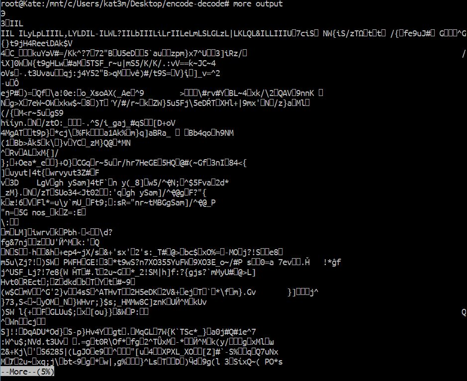

# File Encoder and Decoder

This program uses huffman coding to encode and decode files. I made this project for a data structures class along with a partner.

## Example
Lets see this program in action. I used a txt file containing the script from Romeo and Juliet to use as an example. Here I'm showing the head and tail of the file(first and last ten lines).


Here you can see the size of the text file, as you can see it is 144138 bytes


Next I encode the file and put the output in a file I named output. When I check the size of the file, it's 87822 bytes, a whole 56,316 less!! About 60% smaller! 


Viewing the contents of output, we can see that our file has been encoded. You can sort of make out the beginning which is the magic number and the code to reconstruct the tree which has I's and L's followed by each symbol used. The rest is impossible for any human to comprehend, it is the series of bits the encoder will read to reconstruct the text.



The encoded file is clearly unreadable to any human, so we must use our decoder to bring the file back to its original state. I use decode to take in the encoded file and decode it, putting it's output in a file called original. When the file is decoded, it is identical to the file before it was encoded. As we see here it's back to 144138 bytes.


Just to show that the text is exactly the same as it was before, here's the output of head and tail run on the decoded file.


There you have it, an encoder and decoder written in C using Huffman Coding!

## Getting Started

Clone this repository using git

```
git clone https://github.com/katekaho/encode-decode.git
```

## Prerequisites

I use Bash in order to use this program.
In order to compile this program you must have Java and GCC installed.

If you are using Ubuntu bash and don't have Java, follow these steps:

First update the package index
```
$ sudo apt-get update
```

Next install Java
```
$ sudo apt-get install default-jre
```

If you don't have GCC, install it as well

```
$ sudo apt-get install gcc
```

## Installing

Once you have Java and GCC installed, compile the program using this command:

```
$ make all
```

Once the program is compiled, you should have the encode and decode files in your directory.

If you want to remove the compiled files type:

```
$ make clean
```


## Encoding

To encode a file, call the program encode using ./encode, followed by the -i (input) flag which specifies the input file.

To specify the output file, use the -o (output) flag followed by the name of the file you want the encoded text to go in. 

```
$ ./encode -i nameOfFileToEncode -o encodedFile
```


## Decoding

To decode the encoded file, use flag -i (input) followed by the name of the file you want to decode.
Then use flag -o (output) followed by the name of the file you want the decoded infomation to go in.

```
./decode -i encodedFile -o decodedFile
```

By default, if no output is specified, decode will write to standard out.

```
./decode -i encodedFile
```

## Challenges

Using C to write this program was very difficult. Memory leaks were not fun to deal with. My partner and I had to go to lab every day to get help on how to implement specific parts of the program.

## Components
### Encode: 
- histogram of size 256 to store frequency of each symbol
- queue with frequency and symbol, used to build huffman tree by joining symbols together by frequency continuously until only one element left
- code table which puts the correct path of the characters in the huffman tree into a code
- bit vector which gets repetitively set according to our code table while reading file and writes to output each time it gets full

### Decode:
- tree reconstructor
- char array to store all the decoded charactors
- bit vector to use to step through tree until pointer hits a leaf


